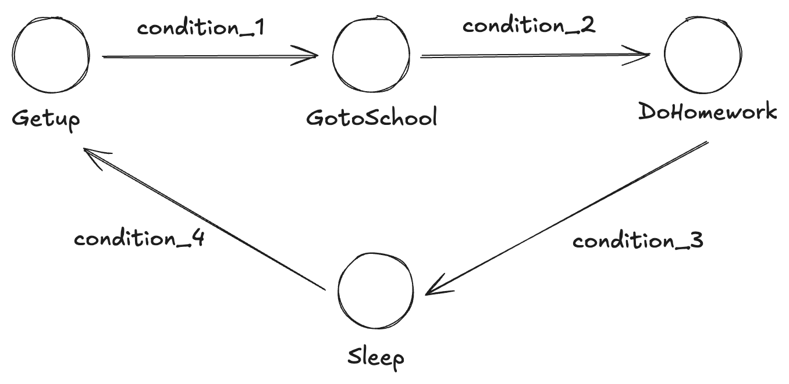

# SimpleFSM

## 简介
状态机是一种广泛应用于软件工程中的设计模式，用于模拟具有多个状态的对象，并在不同状态之间进行转换.

## 用法
SimpleFSM是一个单文件实现的简单状态机，使用时只需要自己定义一个自定义状态机，如StudentFsm（继承自BaseStateMachine）；不同的状态对象如StudentStateGetup（继承自FsmState），然后向状态机注册所有的状态对象
最后再初始化状态对象即可，用户需要自定义状态机中各个状态对象转换条件。




## 编译运行
```sh
make && ./main
enter get up state
exit get up state
enter goto school state
exit goto school state
enter do homework state
exit do homework state
enter sleep state
exit sleep state

